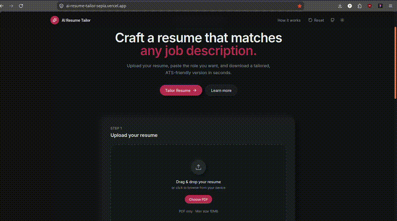

# AI Resume Tailor

Privacy-first web app that tailors an ATS-friendly resume to any job description in under 30 seconds. Upload a resume PDF, provide a job posting, and download a tailored PDF, editable LaTeX source, or both in a ZIP — with no login and no persistent storage.



## Features
- Drag-and-drop resume upload (PDF, max 10MB)
- Job description via pasted text, URL, or PDF/image upload
- AI analysis with Gemini Flash (primary) and Groq (fallback)
- Truthful rewriting — never invents experience, employers, or skills
- ATS-safe LaTeX source + compiled PDF output
- Keyword match insights and improvement suggestions
- No database, no accounts, files deleted after processing

## Tech Stack
| Layer | Technology |
|---|---|
| Frontend | React 19, TanStack Start/Router, Tailwind CSS v4 |
| Backend | TanStack Start server routes (Nitro, Vercel serverless) |
| PDF extraction | unpdf |
| AI | Google Gemini + Groq fallback |
| Output | LaTeX template + PDFKit PDF generation, JSZip bundle |
| Deployment | Vercel |

## Project Structure
```text
ai_resume_tailor/
├── PRD.md                # Product requirements
└── UI_v1/
    ├── src/
    │   ├── routes/        # Pages + API routes (/api/health, /api/tailor)
    │   ├── server/        # Backend services (AI, PDF, LaTeX, validation)
    │   └── lib/           # Client API helpers
    └── vercel.json        # Vercel deployment config
```

## Getting Started
### Prerequisites
- Node.js 20+
- At least one AI API key (Gemini and/or Groq)

### Setup
```bash
cd UI_v1
cp .env.example .env
# Add your API keys to .env
npm install
npm run dev
```
Open `http://localhost:5173`.

### Environment Variables
Create a `.env` file in `UI_v1/` (never commit it):
```env
GEMINI_API_KEY=your_gemini_key
GROQ_API_KEY=your_groq_key
GEMINI_MODEL=gemini-2.0-flash
GROQ_MODEL=llama-3.3-70b-versatile
```
At least one of `GEMINI_API_KEY` or `GROQ_API_KEY` is required.

## API Endpoints
| Method | Path | Description |
|---|---|---|
| GET | `/api/health` | Health check and AI provider status |
| POST | `/api/tailor` | Full tailoring pipeline (multipart form) |

### POST /api/tailor
**Form fields:**
- `resume` — PDF file (required)
- `jobMode` — `text`, `url`, or `file`
- `jobText` — when mode is `text`
- `jobUrl` — when mode is `url`
- `jobFile` — PDF/PNG/JPG when mode is `file`

**Response:**
```json
{
  "success": true,
  "analysis": { "keyword_matches": [], "keyword_missing": [], "..." : "..." },
  "files": {
    "pdfBase64": "...",
    "texBase64": "...",
    "zipBase64": "...",
    "pdfFilename": "tailored-resume.pdf",
    "texFilename": "tailored-resume.tex",
    "zipFilename": "tailored-resume.zip"
  }
}
```

## Deploy to Vercel
1. Push this repository to GitHub.
2. Import the project in [Vercel](https://vercel.com).
3. Set the **Root Directory** to `UI_v1`.
4. Add environment variables (`GEMINI_API_KEY`, `GROQ_API_KEY`).
5. Deploy.

The app uses the Nitro `vercel` preset and builds with `npm run build`.

## Privacy & Security
- No database or persistent file storage
- Uploads processed in memory and discarded after response
- Only extracted text is sent to AI providers
- API keys loaded from environment variables only
- Rate limiting (10 requests/minute per IP)
- LaTeX special-character escaping and JSON schema validation

## License
MIT
